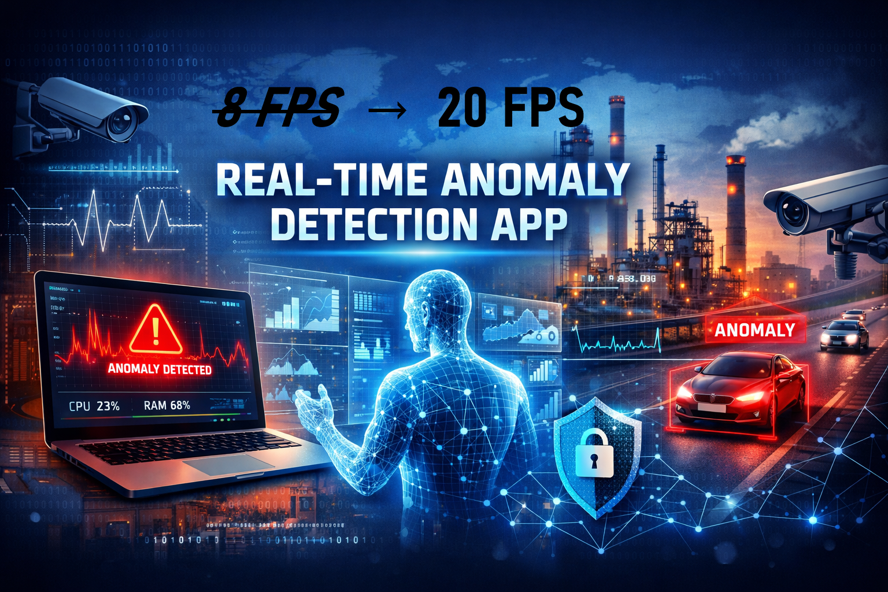

# **Even MORE Real Time** Anomaly Detection App

Inferenzzeit-Optimierte Version: ALT 8.0 FPS / **NEU 20 FPS** (*RDX 3070 Ti)

Real-time Anomalie-Erkennung mit IDS Kameras und DINOv3 Zero-Shot Learning.


---

## 🚀 Quick Start

### Installation (einmalig)

```bash
# Doppelklick auf:
install.bat
```

**Was wird installiert?**
- Python Virtual Environment

- PyTorch mit CUDA 12.1

- FAISS-GPU (k-NN Search)

- PySide6 (Qt6 GUI)

- Alle Dependencies

**Dauer:** ~5-10 Minuten

---

### App starten

```bash
# Doppelklick auf:
start_anomaly_detection_qt.bat
```

**Was passiert?**
- System-Checks (GPU, CUDA, Dependencies)

- Kamera-Erkennung --> USB Kamera anschliessen!

- App-Start mit Live-Stream

Screenshot:


---

## 📋 Voraussetzungen

### Hardware
- ✅ USB Kamera (z.B. Webcam) oder Industry IDS Kamera (GigE PoE)
- ✅ NVIDIA GPU (RTX 3060+ empfohlen)
- ✅ 8+ GB RAM

### Software
- ✅ Windows 10/11
- ✅ Python 3.8 - 3.12
- ✅ [IDS Peak SDK](https://www.ids-imaging.com/downloads.html) installiert
- ✅ Aktueller NVIDIA GPU-Treiber

---

## 🎮 Workflow

### 1️⃣ Projekt erstellen
- **[PROJECT]** → "CREATE NEW"
- Projektname eingeben

### 2️⃣ Ghost Part erfassen
- Perfektes Referenzteil zeigen
- **[CAPTURE GHOST]** oder **SPACEBAR**
- → Transparentes Positionshilfe-Overlay wird erstellt

### 3️⃣ Trainingsbilder erfassen
- **n GOOD** Parts (Training und Test)
- **n GOOD** Parts (Test)
- **n DEFECT** Parts (Anomalien)

### 4️⃣ Training (automatisch)
- DINOv3 Feature-Extraktion
- Memory Bank erstellen
- Threshold optimieren
- **Dauer:** ~3-5 Minuten (RTX 4070)

### 5️⃣ Live Detection
- Real-time Heatmap-Overlay
- Threshold-Slider (Live-Anpassung)
- Background: GRÜN=OK, ROT=Anomalie

---

## 📊 Features

### Real-time Detection
- 30-60 FPS Live-Stream
- 15-30 ms Inferenz (GPU)
- Zero-Shot Learning (kein Re-Training nötig)

### Intelligent Workflow
- Ghost-Part-Positionshilfe
- Automatische Threshold-Optimierung
- Undo-Funktion beim Capture
- Projekt-Management (Save/Load)

### Technologie
- DINOv3 Vision Transformer
- FAISS-GPU k-NN Search
- Cosine Distance Metric
- Patch-Level Anomaly Maps

---

## 🛠️ Troubleshooting

### Problem: PySide6 fehlt
```bash
venv\Scripts\activate.bat
pip install PySide6
```

### Problem: CUDA not available
```bash
# Treiber aktualisieren, dann:
pip uninstall torch torchvision
pip install torch torchvision --index-url https://download.pytorch.org/whl/cu121
```

### Problem: Kamera nicht erkannt
- IDS Peak Cockpit schließen (blockiert Kamera)
- USB 3.0 Port verwenden
- IDS Peak SDK neu installieren

### Problem: Training schlägt fehl
- Batch-Size in ProjectConfig reduzieren (4 → 2)
- Kleineres Modell wählen (ViT-S statt ViT-L)

**Mehr Details:** Siehe [INSTALLATION_GUIDE.md](INSTALLATION_GUIDE.md)

---

## Support

**Fragen? Probleme?**
- 📖 [INSTALLATION_GUIDE.md](INSTALLATION_GUIDE.md) - Ausführliche Dokumentation
- 🐛 GitHub Issues - Bug-Reports & Feature-Requests

**IDS Peak SDK:**
- 📥 [Downloads](https://www.ids-imaging.com/downloads.html)
- 💬 [Support-Forum](https://en.ids-imaging.com/forum.html)

---

## 📝 Version

**Version:** 2.0 (PySide6 Migration)
**Framework:** PySide6 (Qt 6.10)
**Python:** 3.8 - 3.12
**CUDA:** 12.1

---

## Acknowledgements & Scientific Background

This project builds upon established research in industrial visual anomaly detection,
in particular:

- Roth et al., *Towards Total Recall in Industrial Anomaly Detection*, arXiv:2106.08265 (2021)
| 📖 [PatchCore](https://github.com/amazon-science/patchcore-inspection.git)


- Siméoni et al., *DINOv3*, arXiv:2508.10104 (2025)
| 📖 [DINOv3](https://github.com/facebookresearch/dinov3.git)

---

**Viel Erfolg! 🚀**
